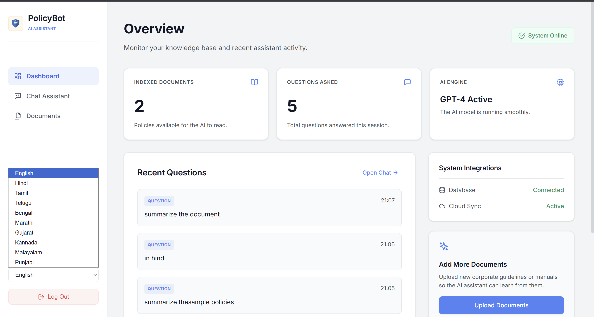
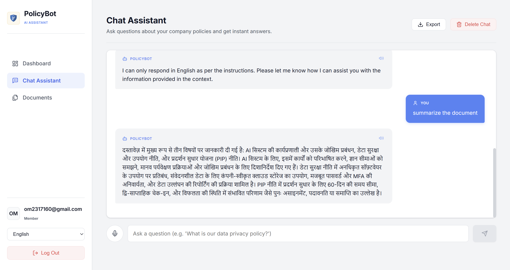
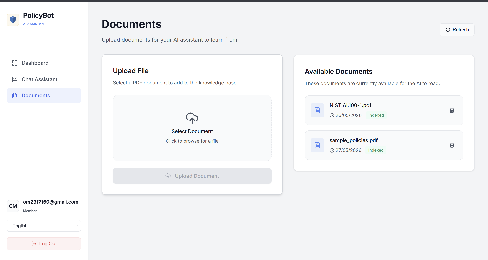
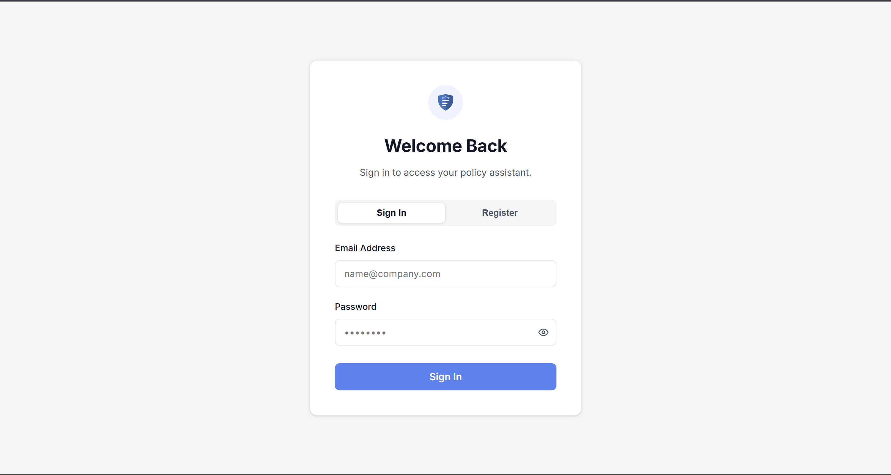
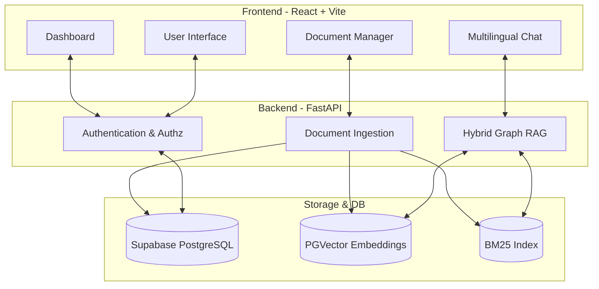

# 🛡️ PolicyBot

**PolicyBot** is an intelligent, multilingual AI assistant designed to help employees navigate company policies seamlessly. By integrating a Hybrid Graph RAG (Retrieval-Augmented Generation) architecture, PolicyBot reads through complex company documents and provides instant, accurate, and citable answers. 

---

## ✨ Key Features

- **🧠 Hybrid Graph RAG System**: Combines vector search (BM25 & PGVector) with semantic chunking to pull exact references from policies.
- **🌍 Multilingual Chat Assistant**: Seamlessly switch between languages (English, Hindi, Tamil, Telugu, Bengali, Marathi, Gujarati, Kannada, Malayalam, Punjabi) to ask questions in your preferred language.
- **📂 Intelligent Document Management**: Easily upload, index, and manage PDF documents. The system automatically processes and indexes new guidelines.
- **📊 Real-time Dashboard**: Monitor the number of indexed documents, total questions asked, and view recent chat history.
- **🔒 Secure Authentication**: Robust login and role-based access for protecting sensitive corporate data.
- **🎨 Modern UI/UX**: A responsive, premium enterprise interface featuring a clean layout, intuitive navigation, and beautiful aesthetics.

---

## 📸 Gallery

<details open>
<summary><b>Dashboard</b></summary>
<br>
<i>Get a high-level overview of indexed documents and recent employee questions.</i><br>

</details>

<details>
<summary><b>Chat Assistant (Multilingual)</b></summary>
<br>
<i>Ask questions and receive instant answers in multiple languages.</i><br>

</details>

<details>
<summary><b>Document Management</b></summary>
<br>
<i>Upload and index company policies directly from the UI.</i><br>

</details>

<details>
<summary><b>Secure Login</b></summary>
<br>
<i>Simple and secure authentication.</i><br>

</details>

*(Note: Add the screenshots provided to a `screenshots` folder in the repository root to display them here.)*

---

## 🏗️ Architecture

PolicyBot uses a robust full-stack architecture to ensure scalability, security, and performance.



---

## 🛠️ Tech Stack

### Frontend
- **Framework**: [React 18](https://reactjs.org/) + [Vite](https://vitejs.dev/)
- **Routing**: React Router DOM
- **Icons**: Lucide React
- **Styling**: Vanilla CSS (Modern Enterprise Light Theme)

### Backend
- **Framework**: [FastAPI](https://fastapi.tiangolo.com/)
- **Authentication**: JWT, Passlib (bcrypt), python-jose
- **AI/LLM**: [LangChain](https://www.langchain.com/) for orchestrating the RAG pipeline.
- **Document Processing**: PyMuPDF for parsing PDFs.

### Database
- **Primary Database**: [Supabase](https://supabase.com/) (PostgreSQL)
- **Vector Search**: PGVector & BM25 for hybrid search.

---

## 🚀 Getting Started

### Prerequisites
- Node.js (v18+)
- Python (3.10+)
- Supabase account/project

### 1. Clone the repository
```bash
git clone https://github.com/Cypher-redeye/PolicyBot.git
cd PolicyBot
```

### 2. Backend Setup
```bash
cd backend
python -m venv .venv
# Activate virtual environment
# Windows: .venv\Scripts\activate
# Mac/Linux: source .venv/bin/activate

pip install -r requirements.txt
```
*Configure your environment variables by copying `.env.example` to `.env` and adding your Supabase credentials and OpenAI API keys.*
```bash
# Run the backend server
uvicorn main:app --reload
```

### 3. Frontend Setup
```bash
cd frontend
npm install

# Start the Vite development server
npm run dev
```

### 4. Database Migrations
Initialize the Supabase database using the provided SQL scripts in the `backend` folder:
- `db_init.sql`
- `db_migrate_auth.sql`
- `db_migrate_graph.sql`
- `db_migrate_language.sql`
- `db_migrate_ml.sql`

---

## 📄 License
This project is licensed under the MIT License. See the `LICENSE` file for more details.
